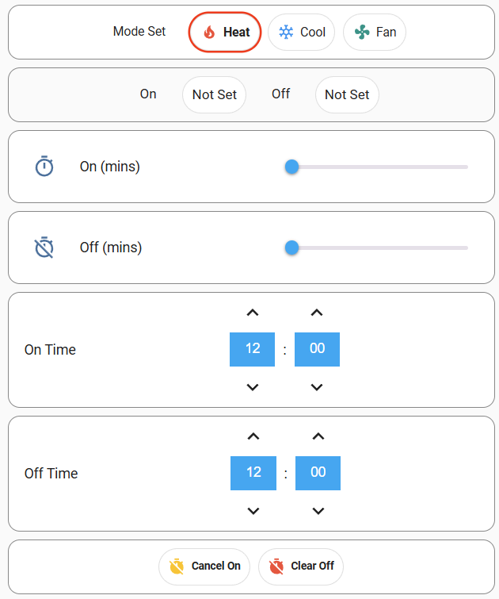

# Home Assistant Dashboards
## airtouch-timers.yaml
This dashboard is set up to turn Airtouch 4 and likely Airtouch 5 systems on and off using its build in timers, in a way that's compact and easy to use. Some may use the dashaboard as it is, I'll probably incorporate it into other dashboards at some point. This dashboard seems to work but it's new, so there are probably bugs.

The on time / off time is set at 12:00 by default, even if the timers aren't on. This is because it uses an input_datetime which can't be cleared. I haven't looked for a better way to do this yet as it's good enough.

See the screenshot below.

### Dependencies
For this to work you will need:
 - mushroom-template-card [link](https://github.com/piitaya/lovelace-mushroom)
 - slider-entity-row [link](https://github.com/thomasloven/lovelace-slider-entity-row)

Maybe other things too. Questions and pull requests are welcome.

### Setup
 - Copy the configuration.yaml and sensors.yaml content into your files of the same name
 - Create the automations. Call them whatever you like as they're all event based rather than being called explicitly.
 - Create the services, which need to be named exactly as I've specified, otherwise you'll need to change the dashboard code slightly:
   - The file script-airtouch-clear-on-timer.yaml needs to be in an automation ID "script.atp_clear_on_timer"
   - The file script-airtouch-clear-of-timer.yaml needs to be in an automation ID "script.atp_clear_off_timer"

### Screenshot
