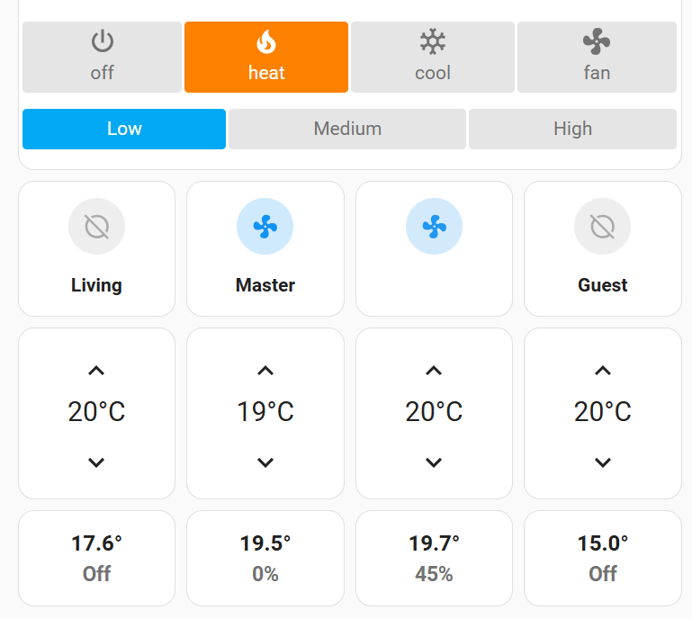

# Home Assistant Dashbaords
## airtouch-dashboard1.yaml
This dashboard is set up for a four zone Airtouch 4 system. It's fairly easy to add zones. Tap the temperature control for the zone to change to "damper control"
mode, tap it again to change back.

The "Off Timer" section hooks into an AppDaemon app I haven't published to turn the system off after a configurable amount of time, providing a countdown.  I wrote this a while back, these days I would probably hook into the Airtouch off timer as the latest integration works with that. It could probably be done with automations as well. It's probably easiest to delete that section but I left it in in case it helps someone.

### Dependencies
For this to work you will need:
 - mushroom-template-card [link](https://github.com/piitaya/lovelace-mushroom)
 - simple-thermostat [link](https://github.com/nervetattoo/simple-thermostat)
 - slider-entity-row [link](https://github.com/thomasloven/lovelace-slider-entity-row)

## Screenshot
