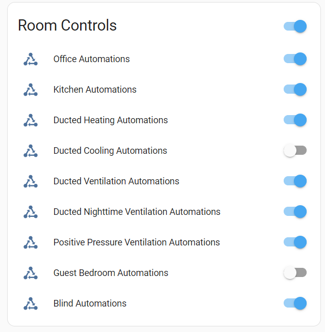

# Room Controls
This set of configuration entries, dashboard and automations enables me to simply enable and disable automations for individual rooms, or more broadly enable or disable automations for a device. It needs to be set up manually to suit your home.

## Dashboard


## Installation
1. Copy the contents of configuration.yaml into your configuration.yaml. Change the names, descriptions, and default states. I have anything that uses significant power defaulting to "off" so that if there's a power cut heating or cooling doesn't start automatically. I also have alerts for when heating comes on when rooms are disabled.
2. Create a new dashboard and view it as yaml. Copy and paste dashboard from dashboard.yaml
3. Edit your automations to have conditions that include the booleans you define. For example


```
alias: Office 0530 weekdays below 11
description: Turn on the office to 22deg at 5.30am weekdays from March to November
trigger:
  - platform: time
    at: "05:30:00"
condition:
  - condition: state
    entity_id: input_boolean.office_automations_enabled
    state: "on"
  - condition: time
    before: "00:00:00"
    weekday:
      - mon
      - tue
      - thu
      - fri
      - wed
    after: "00:00:00"
  - condition: template
    value_template: "{{ now().month in [3, 4, 5, 6, 7, 8, 9, 10] }}"
    alias: Month is Mar - Oct
  - condition: numeric_state
    entity_id: sensor.officesensor_temperature
    below: 11
action:
  - service: climate.set_hvac_mode
    data:
      hvac_mode: heat
    target:
      entity_id: climate.office_daikin
  - delay:
      hours: 0
      minutes: 0
      seconds: 1
      milliseconds: 0
  - service: climate.set_temperature
    data:
      temperature: 22
    target:
      entity_id: climate.office_daikin
  - delay:
      hours: 0
      minutes: 0
      seconds: 1
      milliseconds: 0
  - service: climate.set_fan_mode
    data:
      fan_mode: "3"
    target:
      entity_id: climate.office_daikin
mode: single
```